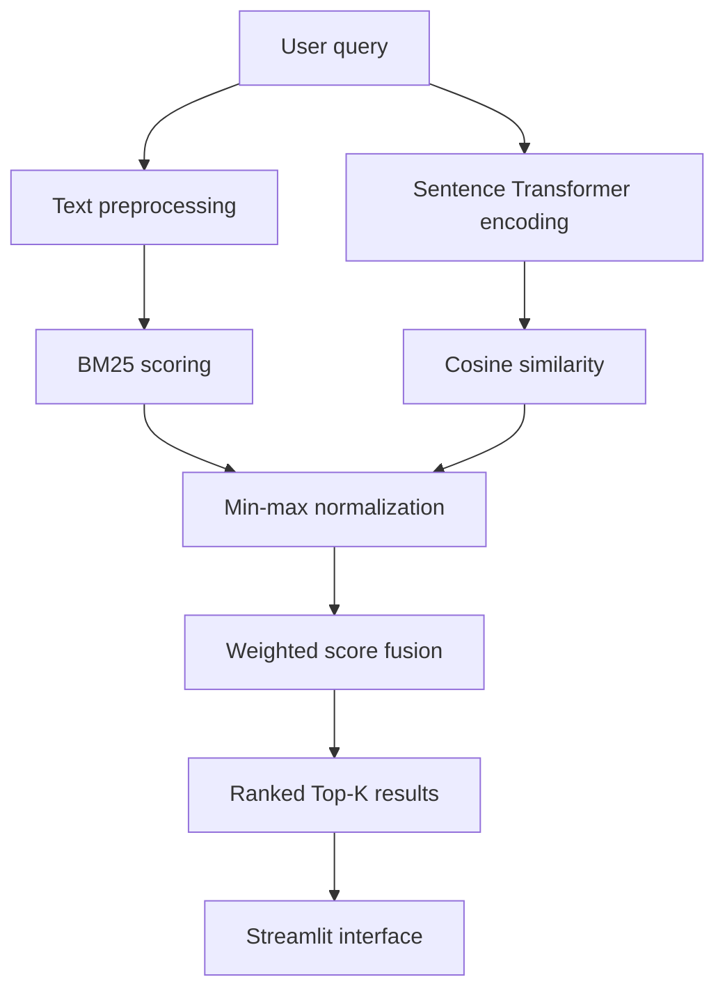

# Semantic Search Engine with Hybrid Ranking

The interactive information retrieval application uses **BM25 Lexical Search** along with **Transformer Semantic Search**. This information retrieval system performs retrieval based on evidence based on keywords and meaning, normalizes both scores, and fuses them to form a configurable hybrid ranker.

## Overview

Keyword search works well if there is a match in the terminology used in the query and the document, but it might fail to find some documents that convey the same idea through different vocabulary. Semantic search takes care of meaning, though it does not consider any exact match.

This project uses both these techniques:

- **BM25**: Computes lexical relevance based on the frequency of query-term occurrence, inverse document frequency, and document-length normalization.
- **Sentence Transformers**: Encodes the queries and documents into dense vectors representing semantic meaning.
- **Cosine Similarity**: Computes the similarity of queries and documents embedding.
- **Weighted Score Fusion**: Generates the final hybrid score and allows control over the lexical-semantic balancing.

The provided Streamlit interface allows for live query testing, adjustable BM25 weights, flexible number of results to retrieve, individual component score inspection, and corpus exploration.

## Features

- BM25-based keyword retrieval with `rank-bm25`
- Semantic retrieval using `sentence-transformers/all-MiniLM-L6-v2`
- Normalized fusion of lexical and semantic scores
- Adjustable BM25 weight through the Streamlit sidebar
- Configurable Top-K retrieval
- Per-result BM25, semantic, and hybrid score display
- Offline evaluation using Precision@K, Recall@K, MAP, and MRR
- Small sample corpus, query set, and relevance judgments for demonstration

## How Hybrid Ranking Works

For a query $q$ and document $d$, the application calculates a BM25 score and a cosine-similarity score. Because these values have different ranges, each score set is independently scaled to $[0,1]$ using min–max normalization.

The final score is:

$$
\text{HybridScore}(q,d)=\alpha\,\text{BM25}_{norm}(q,d)+(1-\alpha)\,\text{Semantic}_{norm}(q,d)
$$

where:

- $\alpha=1$ uses only BM25.
- $\alpha=0$ uses only semantic similarity.
- $\alpha=0.5$ gives both methods equal weight.

Documents are sorted by this hybrid score and the highest-ranked `Top K` results are returned.

## Architecture



Document embeddings are generated when the search engine is initialized. Streamlit caches the engine as a resource, avoiding repeated model and corpus initialization during interface reruns.

## Technology Stack

| Component | Technology |
|---|---|
| Programming language | Python |
| Lexical retrieval | BM25Okapi (`rank-bm25`) |
| Semantic retrieval | Sentence Transformers |
| Embedding model | `sentence-transformers/all-MiniLM-L6-v2` |
| Similarity function | Cosine similarity |
| Data processing | pandas, NumPy |
| Interface | Streamlit |
| Evaluation | Custom Python implementations of IR metrics |

## Project Structure

```text
semantic-search-ir/
├── data/
│   ├── corpus.csv       # Documents and metadata
│   ├── queries.csv      # Evaluation queries
│   └── qrels.csv        # Query-document relevance judgments
├── src/
│   ├── app.py           # Streamlit application
│   ├── evaluate.py      # Evaluation metrics and runner
│   └── utils.py         # Preprocessing and hybrid search engine
├── requirements.txt
└── README.md
```

## Getting Started

### Prerequisites

- Python 3.10 or later
- Internet access during the first run to download the Sentence Transformer model

### Installation

1. Clone the repository and enter the project directory:

   ```bash
   git clone <your-repository-url>
   cd semantic-search-ir
   ```

2. Create and activate a virtual environment:

   **macOS/Linux**

   ```bash
   python3 -m venv .venv
   source .venv/bin/activate
   ```

   **Windows PowerShell**

   ```powershell
   py -m venv .venv
   .venv\Scripts\Activate.ps1
   ```

3. Install the dependencies:

   ```bash
   pip install -r requirements.txt
   ```

## Run the Search Application

From the project root, run:

```bash
streamlit run src/app.py
```

Streamlit will display a local address, typically `http://localhost:8501`.

Use the sidebar to:

- Change **BM25 weight (alpha)** from `0.0` to `1.0`.
- Select how many results to return.
- Compare the BM25, semantic, and hybrid scores for each result.

Example query:

```text
hybrid retrieval combining lexical and dense ranking
```

## Run the Evaluation

The repository includes sample queries and binary relevance judgments. Run the evaluator from the project root:

```bash
python src/evaluate.py
```

The current script evaluates the system at `Top K = 5` with `alpha = 0.5` and reports:

- **Precision@K:** proportion of the first K retrieved documents that are relevant
- **Recall@K:** proportion of all relevant documents retrieved in the first K results
- **MAP:** mean of average precision across evaluation queries
- **MRR:** mean reciprocal rank of the first relevant result

To experiment with other settings, update the call at the bottom of `src/evaluate.py` or invoke the `evaluate(alpha=..., top_k=...)` function from Python.

> The bundled dataset is intentionally small and is meant to demonstrate the complete retrieval and evaluation pipeline. Performance on it should not be interpreted as a benchmark for production-scale search.

## Data Format

### `corpus.csv`

| Column | Description |
|---|---|
| `doc_id` | Unique document identifier |
| `title` | Document title |
| `category` | Document category |
| `text` | Searchable document content |

The title and text fields are concatenated before indexing and embedding.

### `queries.csv`

| Column | Description |
|---|---|
| `query_id` | Unique query identifier |
| `query` | Query text |

### `qrels.csv`

| Column | Description |
|---|---|
| `query_id` | Query identifier |
| `doc_id` | Relevant document identifier |
| `relevance` | Relevance label |

## Extending the Project

Possible next steps include:

- Evaluate on a larger public retrieval dataset such as BEIR or ANTIQUE.
- Add NDCG@K and graded-relevance evaluation.
- Tune `alpha` using a validation query set rather than selecting it manually.
- Persist document embeddings to avoid recomputation on application startup.
- Use FAISS or another vector index for scalable nearest-neighbor retrieval.
- Add query filters, highlighting, result explanations, and search-history analysis.
- Deploy the Streamlit application for public access.

## Skills Demonstrated

- Information retrieval and ranking
- Lexical and dense retrieval
- Transformer embeddings
- Score normalization and rank fusion
- Retrieval evaluation
- Interactive ML application development
- Modular Python project design

## License

This project does not currently include a license. Add a `LICENSE` file before distributing or accepting external contributions.

## Author

**Nikshitha Rapolu**

- [LinkedIn](https://www.linkedin.com/in/nikshitha-rapolu-18960321a/)
- [GitHub](https://github.com/nikshitharapolu)
