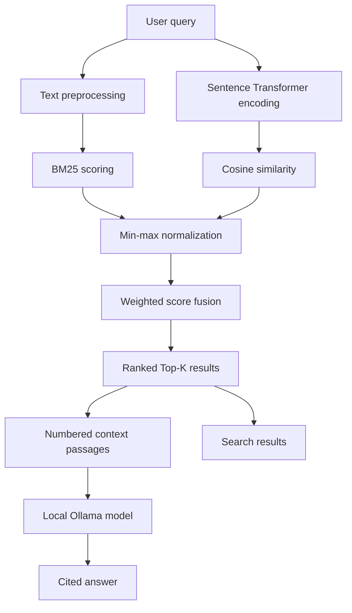

# Semantic Search Engine with Hybrid Ranking

The interactive information retrieval application uses **BM25 Lexical Search** along with **Transformer Semantic Search**. This information retrieval system performs retrieval based on evidence based on keywords and meaning, normalizes both scores, and fuses them to form a configurable hybrid ranker.

## Overview

Keyword search works well if there is a match in the terminology used in the query and the document, but it might fail to find some documents that convey the same idea through different vocabulary. Semantic search takes care of meaning, though it does not consider any exact match.

This project uses both these techniques:

- **BM25**: Computes lexical relevance based on the frequency of query-term occurrence, inverse document frequency, and document-length normalization.
- **Sentence Transformers**: Encodes the queries and documents into dense vectors representing semantic meaning.
- **Cosine Similarity**: Computes the similarity of queries and documents embedding.
- **Weighted Score Fusion**: Generates the final hybrid score and allows control over the lexical-semantic balancing.

The provided Streamlit interface allows for live query testing, adjustable BM25 weights, flexible number of results to retrieve, individual component score inspection, and corpus exploration.

## Features

- **Citation-grounded RAG:** Answers questions from retrieved passages and attaches numbered sources.
- **Fully local generation:** Uses Ollama by default, with no paid model API or cloud dependency.
- **Resilient offline mode:** Falls back to extractive evidence when Ollama is unavailable.
- **Prompt-injection-aware context:** Retrieved documents are explicitly treated as untrusted data.
- **Document ingestion:** Upload PDF, TXT, and Markdown documents from the Streamlit sidebar.
- **Overlapping chunking:** Splits longer documents into retrieval-sized passages while retaining boundary context.
- **Persistent vector index:** Reuses locally cached embeddings until the corpus or embedding model changes.
- **Safe local storage:** Enforces file types and size limits, sanitizes names, and detects duplicate uploads.
- **FastAPI service:** Exposes validated health, search, RAG, and document-ingestion endpoints.
- **Dockerized services:** Runs the API and Streamlit UI as non-root containers with persistent data volumes.
- **Kubernetes deployment:** Provides local `kind` manifests with storage, probes, limits, autoscaling, and restricted security contexts.
- **AWS-compatible storage:** Persists original uploads in an encrypted, versioned S3 bucket through Moto.
- **Infrastructure as code:** Provisions S3 security controls and a least-privilege IAM policy with Terraform.

- BM25-based keyword retrieval with `rank-bm25`
- Semantic retrieval using `sentence-transformers/all-MiniLM-L6-v2`
- Normalized fusion of lexical and semantic scores
- Adjustable BM25 weight through the Streamlit sidebar
- Configurable Top-K retrieval
- Per-result BM25, semantic, and hybrid score display
- Offline evaluation using Precision@K, Recall@K, MAP, and MRR
- Small sample corpus, query set, and relevance judgments for demonstration

## How Hybrid Ranking Works

For a query $q$ and document $d$, the application calculates a BM25 score and a cosine-similarity score. Because these values have different ranges, each score set is independently scaled to $[0,1]$ using min–max normalization.

The final score is:

$$
\text{HybridScore}(q,d)=\alpha\,\text{BM25}_{norm}(q,d)+(1-\alpha)\,\text{Semantic}_{norm}(q,d)
$$

where:

- $\alpha=1$ uses only BM25.
- $\alpha=0$ uses only semantic similarity.
- $\alpha=0.5$ gives both methods equal weight.

Documents are sorted by this hybrid score and the highest-ranked `Top K` results are returned.

## Architecture



Document embeddings are generated when the search engine is initialized. Streamlit caches the engine as a resource, avoiding repeated model and corpus initialization during interface reruns.

## Technology Stack

| Component | Technology |
|---|---|
| Programming language | Python |
| Lexical retrieval | BM25Okapi (`rank-bm25`) |
| Semantic retrieval | Sentence Transformers |
| Embedding model | `sentence-transformers/all-MiniLM-L6-v2` |
| Similarity function | Cosine similarity |
| Data processing | pandas, NumPy |
| Interface | Streamlit |
| Service API | FastAPI and Pydantic |
| Containerization | Docker and Docker Compose |
| Orchestration | Kubernetes, Kustomize, and kind |
| AWS development | S3, IAM, Moto Server, boto3, and Terraform |
| Evaluation | Custom Python implementations of IR metrics |
| Local generation | Ollama with configurable local model |
| RAG safety | Untrusted-context instructions and grounded citations |
| Document extraction | pypdf and UTF-8 text extraction |
| Vector persistence | NumPy embedding index with a fingerprinted manifest |

## Project Structure

```text
semantic-search-ir/
├── data/
│   ├── corpus.csv       # Documents and metadata
│   ├── queries.csv      # Evaluation queries
│   ├── qrels.csv        # Query-document relevance judgments
│   ├── uploaded_corpus.csv # Generated local upload metadata (gitignored)
│   └── index/            # Generated persistent embeddings (gitignored)
├── src/
│   ├── api.py           # Validated FastAPI endpoints
│   ├── app.py           # Streamlit application
│   ├── generation.py    # Ollama adapter and offline fallback
│   ├── ingestion.py     # Safe extraction, chunking, and persistence
│   ├── rag.py           # Retrieval-augmented generation pipeline
│   ├── service.py       # Shared cached application services
│   ├── evaluate.py      # Evaluation metrics and runner
│   └── utils.py         # Preprocessing and hybrid search engine
├── tests/
│   ├── test_ingestion.py # Extraction, chunking, and duplicate tests
│   └── test_rag.py      # RAG grounding and fallback tests
├── k8s/                  # Kubernetes workloads, services, PVC, and HPA
├── infra/
│   ├── moto/             # Local least-privilege IAM policy
│   └── terraform/        # Versioned S3 and least-privilege IAM resources
├── scripts/
│   └── deploy-kind.sh    # Repeatable local cluster deployment
├── requirements.txt
├── Dockerfile
├── compose.yaml
└── README.md
```

## Getting Started

### Prerequisites

- Python 3.10 or later
- Internet access during the first run to download the Sentence Transformer model

### Installation

1. Clone the repository and enter the project directory:

   ```bash
   git clone <your-repository-url>
   cd semantic-search-ir
   ```

2. Create and activate a virtual environment:

   **macOS/Linux**

   ```bash
   python3 -m venv .venv
   source .venv/bin/activate
   ```

   **Windows PowerShell**

   ```powershell
   py -m venv .venv
   .venv\Scripts\Activate.ps1
   ```

3. Install the dependencies:

   ```bash
   pip install -r requirements.txt
   ```

## Run the Search Application

For local answer generation, install Ollama and download the default model once:

```bash
ollama pull llama3.2:3b
ollama serve
```

The application still runs if Ollama is not available; it returns the strongest retrieved evidence instead.

From the project root, run:

```bash
streamlit run src/app.py
```

Streamlit will display a local address, typically `http://localhost:8501`.

Use the sidebar to:

- Upload and index a PDF, TXT, or Markdown file of up to 10 MB.
- Choose between cited RAG answers and direct document search.
- Change **BM25 weight (alpha)** from `0.0` to `1.0`.
- Select how many results to return.
- Compare the BM25, semantic, and hybrid scores for each result.

Example query:

```text
hybrid retrieval combining lexical and dense ranking
```

Uploaded documents are stored locally in `data/uploaded_corpus.csv`. Their embeddings are cached under
`data/index/`. Both locations are ignored by Git so personal documents and generated vectors are not committed.
Uploading the same file again does not create duplicate chunks.

## Run the Evaluation

The repository includes sample queries and binary relevance judgments. Run the evaluator from the project root:

```bash
python src/evaluate.py
```

The current script evaluates the system at `Top K = 5` with `alpha = 0.5` and reports:

- **Precision@K:** proportion of the first K retrieved documents that are relevant
- **Recall@K:** proportion of all relevant documents retrieved in the first K results
- **MAP:** mean of average precision across evaluation queries
- **MRR:** mean reciprocal rank of the first relevant result

To experiment with other settings, update the call at the bottom of `src/evaluate.py` or invoke the `evaluate(alpha=..., top_k=...)` function from Python.

> The bundled dataset is intentionally small and is meant to demonstrate the complete retrieval and evaluation pipeline. Performance on it should not be interpreted as a benchmark for production-scale search.

## Run the Tests

The test suite uses Python's standard library and does not contact an external model API:

```bash
python -m unittest discover -s tests -v
```

## Run the API

Start Ollama separately, then launch the API from the project root:

```bash
uvicorn api:app --app-dir src --reload --port 8000
```

Open the interactive API documentation at `http://localhost:8000/docs`. Available endpoints are:

| Endpoint | Purpose |
|---|---|
| `GET /health` | Container and service health check |
| `POST /search` | Hybrid BM25 and semantic retrieval |
| `POST /ask` | Citation-grounded RAG answer |
| `POST /documents` | Upload and index PDF, TXT, or Markdown |

Example request:

```bash
curl -X POST http://localhost:8000/ask \
  -H 'Content-Type: application/json' \
  -d '{"query":"How does hybrid retrieval work?","alpha":0.5,"top_k":5}'
```

## Run with Docker and a Local AWS Emulator

Keep Ollama running on the Mac, then build and start the UI, API, and Moto AWS emulator services:

```bash
docker compose up --build
```

- Streamlit UI: `http://localhost:8501`
- FastAPI documentation: `http://localhost:8000/docs`
- Health check: `http://localhost:8000/health`
- Local AWS endpoint: `http://localhost:4566`

The containers connect to the host Ollama server through `host.docker.internal`. The local `data` directory is
mounted into both services, so uploaded documents and the vector index survive container restarts. Stop the
services with:

```bash
docker compose down
```

The free MiniLM embedding model is downloaded once while the Docker image builds and then used in offline mode.
The application containers remain non-root and do not need a writable Hugging Face cache or runtime model download.

Moto creates an S3 bucket named `rag-documents`, enables versioning and AES-256 server-side encryption, and
creates an IAM policy restricted to listing that bucket and reading/writing objects under `documents/*`. The app
uses content-addressed keys such as `documents/<checksum>/<filename>`, making repeat uploads idempotent.

After uploading a document, inspect the locally emulated AWS resources:

```bash
docker compose exec api python scripts/inspect_aws_mock.py
```

The `/documents` API response includes the S3 URI and SHA-256 checksum of the stored original.

## Provision Local AWS Infrastructure with Terraform

Terraform provisions a second demonstration bucket (`rag-documents-iac`) so its lifecycle remains separate from
the bucket automatically initialized in Moto for the running application:

```bash
cd infra/terraform
terraform init
terraform fmt -check
terraform validate
terraform plan
terraform apply
```

Enter `yes` when prompted. These commands target only Moto at `localhost:4566`; they do not use a real AWS
account. Inspect the result:

```bash
docker compose exec api python scripts/inspect_aws_mock.py
```

Return to `infra/terraform` and remove only the Terraform-managed local resources when finished:

```bash
terraform destroy
```
## Run the Sandboxed Black-Box Evaluation

The evaluator interacts only with the application's public HTTP API. It tests:

- Citation-grounded answers
- Prompt-injection resistance
- Request validation
- Response latency
- Read-only filesystem enforcement
- External-network isolation

The evaluator runs as an unprivileged user with a read-only root filesystem, no Linux capabilities, resource limits, and an internal-only Docker network.

Keep the Compose application running. In another terminal, run:

```bash
mkdir -p reports

docker compose --profile evaluation run --rm blackbox-eval \
  | tee reports/blackbox-evaluation.json
```

## Deploy to Local Kubernetes

This deployment uses `kind`, which runs Kubernetes nodes as local Docker containers and does not create a paid
cloud cluster. Install the required command-line tools on macOS:

```bash
brew install kind kubectl
```

Keep Docker Desktop and the host Ollama server running. Stop the Compose deployment to release ports:

```bash
docker compose down
```

Deploy the application:

```bash
chmod +x scripts/deploy-kind.sh
./scripts/deploy-kind.sh
```

After both deployments become ready, expose them in two separate terminals:

```bash
kubectl port-forward service/rag-ui 8501:8501 -n rag-platform
```

```bash
kubectl port-forward service/rag-api 8000:8000 -n rag-platform
```

Inspect the Kubernetes resources with:

```bash
kubectl get pods,services,pvc,hpa -n rag-platform
kubectl describe deployment rag-api -n rag-platform
kubectl logs deployment/rag-api -n rag-platform
```

The manifests apply the Kubernetes Restricted Pod Security profile, run with UID/GID `10001`, disable service
account token mounting, drop all Linux capabilities, prevent privilege escalation, use the runtime-default seccomp
profile, and make the container root filesystem read-only. Only `/app/state` and `/tmp` are writable.

The HPA configuration scales the API from one to three replicas when average CPU utilization exceeds 70%.
A Metrics Server must be installed in the local cluster before live CPU-driven scaling occurs; the HPA manifest
can still be inspected without it.

Delete the free local cluster when finished:

```bash
kind delete cluster --name rag-local
```

## Data Format

### `corpus.csv`

| Column | Description |
|---|---|
| `doc_id` | Unique document identifier |
| `title` | Document title |
| `category` | Document category |
| `text` | Searchable document content |

The title and text fields are concatenated before indexing and embedding.

### `queries.csv`

| Column | Description |
|---|---|
| `query_id` | Unique query identifier |
| `query` | Query text |

### `qrels.csv`

| Column | Description |
|---|---|
| `query_id` | Query identifier |
| `doc_id` | Relevant document identifier |
| `relevance` | Relevance label |

## Extending the Project

Possible next steps include:

- Evaluate on a larger public retrieval dataset such as BEIR or ANTIQUE.
- Add NDCG@K and graded-relevance evaluation.
- Tune `alpha` using a validation query set rather than selecting it manually.
- Persist document embeddings to avoid recomputation on application startup.
- Use FAISS or another vector index for scalable nearest-neighbor retrieval.
- Add query filters, highlighting, result explanations, and search-history analysis.
- Deploy the Streamlit application for public access.

## Skills Demonstrated

- Information retrieval and ranking
- Lexical and dense retrieval
- Transformer embeddings
- Score normalization and rank fusion
- Retrieval evaluation
- Interactive ML application development
- Modular Python project design

## License

This project does not currently include a license. Add a `LICENSE` file before distributing or accepting external contributions.

## Author

**Nikshitha Rapolu**

- [LinkedIn](https://www.linkedin.com/in/nikshitha-rapolu-18960321a/)
- [GitHub](https://github.com/nikshitharapolu)
